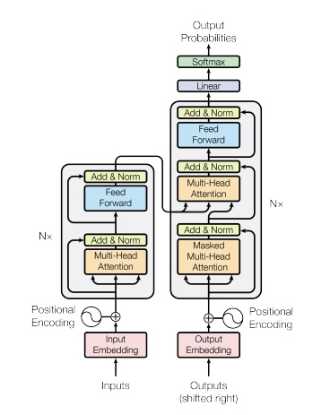

# minillm

This is implementation of Google Transformer library: 

https://proceedings.neurips.cc/paper_files/paper/2017/file/3f5ee243547dee91fbd053c1c4a845aa-Paper.pdf

Transformer is a neural network architecture that performs sequence to sequence learning:




To run the code you just need to have python 3.10 installed in your system. Then just run following command:

```
make all
```

It will download the data and run the training.